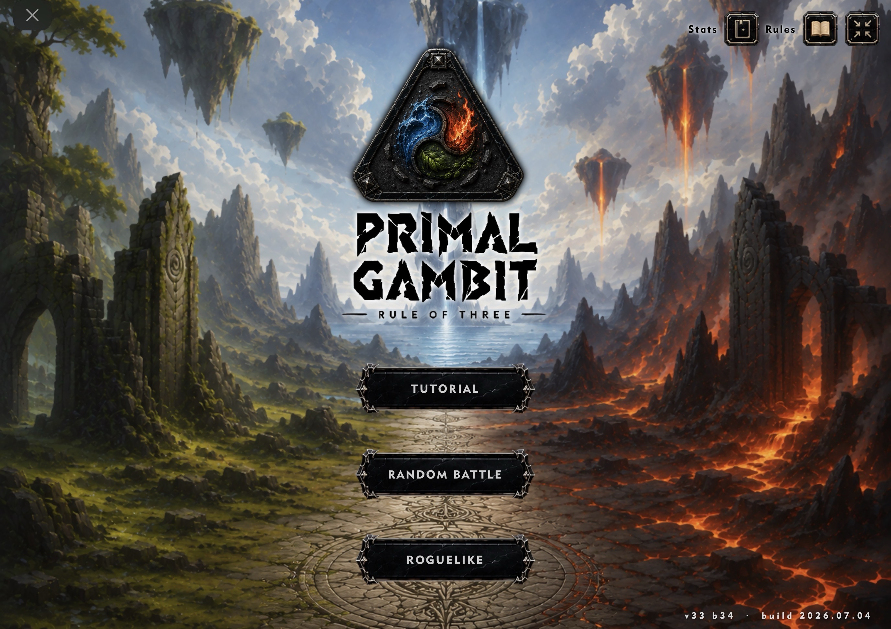
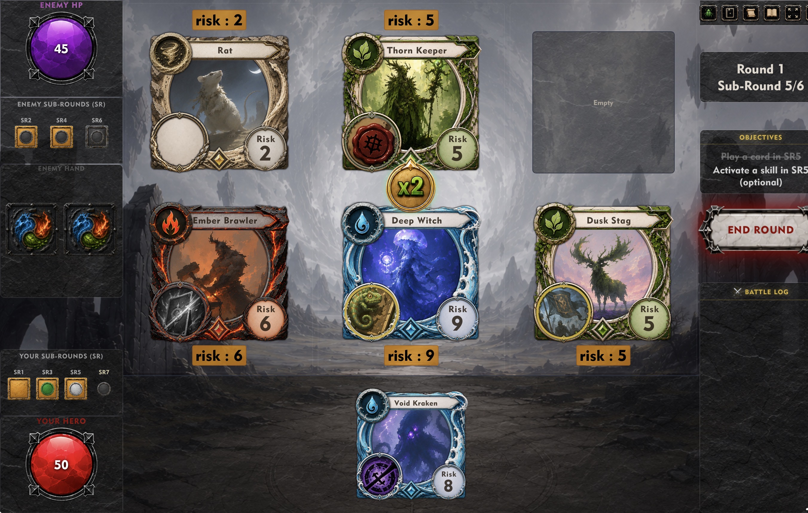
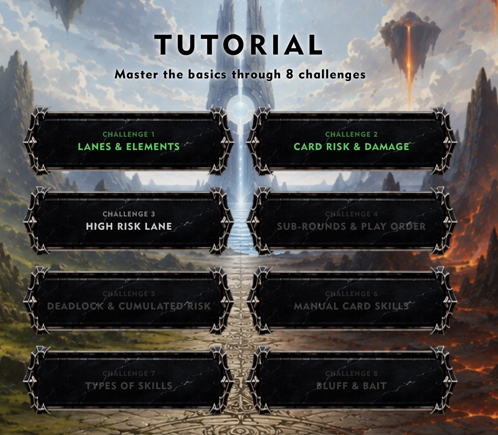
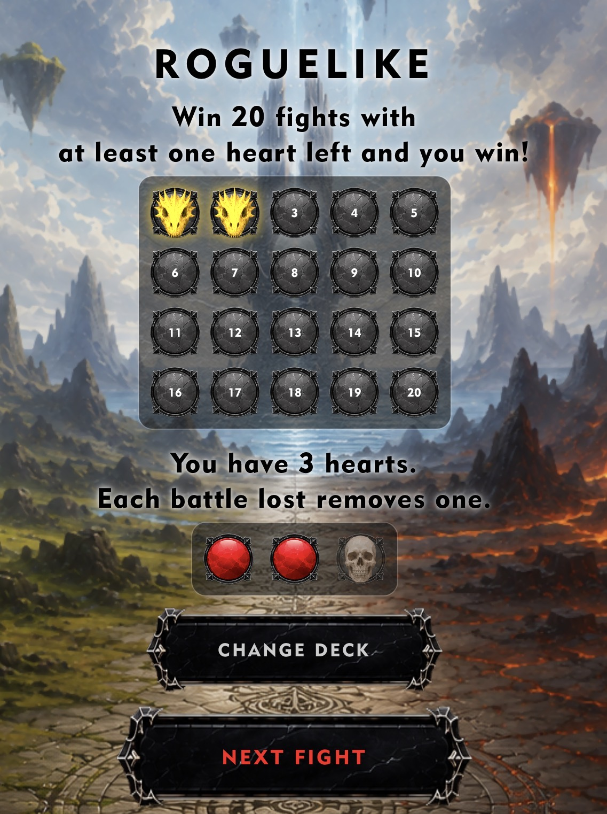
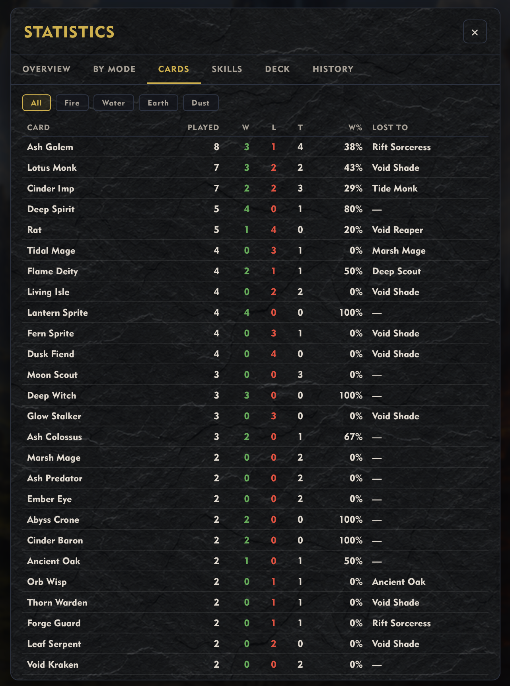
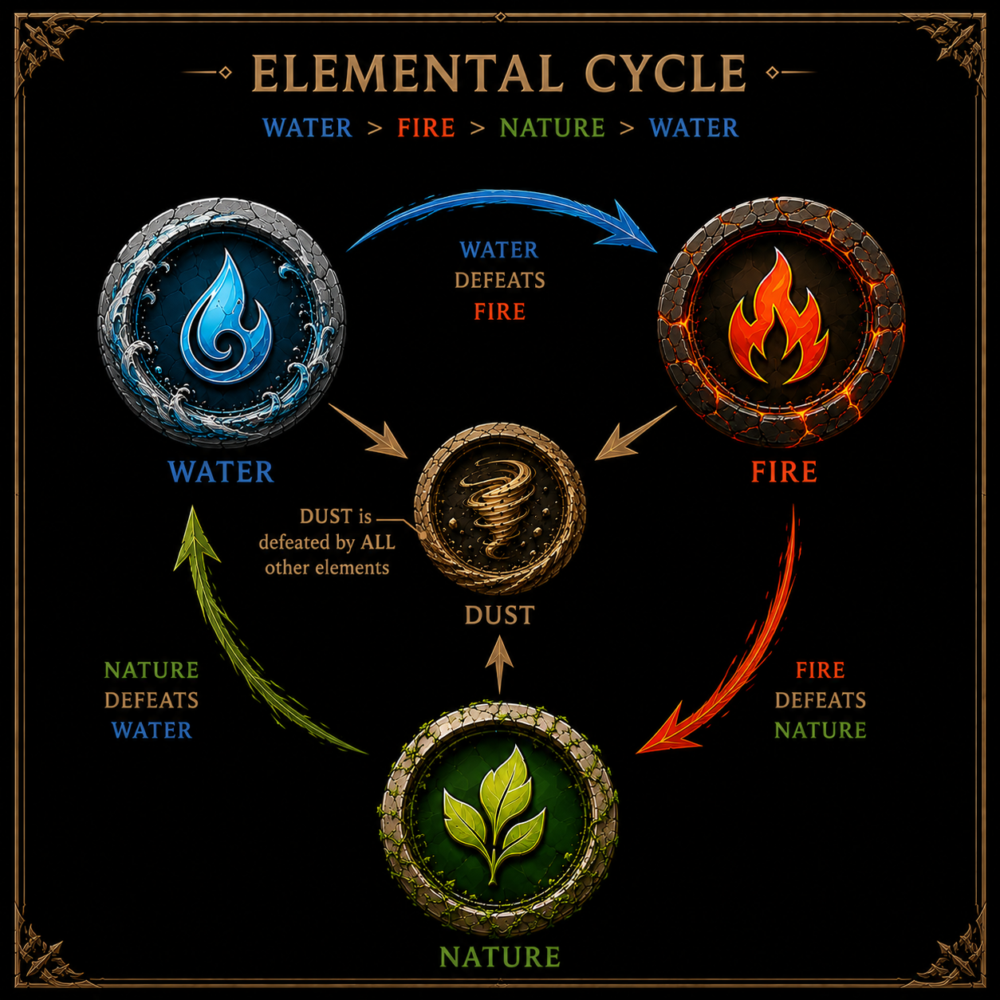
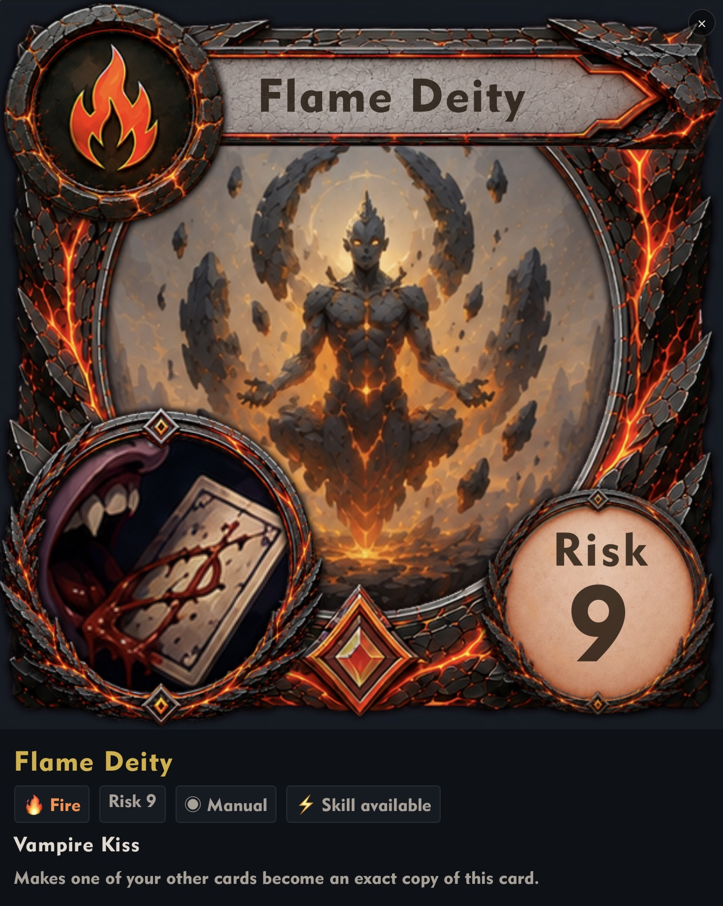

# Primal Gambit — Rule of Three

> *A fan-made revival of EarthCore, built with love, stubbornness, and a lot of AI assistance.*

---

## What is this?

If you ever played **EarthCore: Shattered Elements**, you know the feeling. A card game that was deep, elegant, and just different enough to get under your skin. Then one day it was gone — servers down, no warning, no farewell. Just gone.

I spent hundreds of hours on that game. And I missed it.

So I decided to rebuild it. Not as a professional developer — I'm not one. As someone who wanted to play it again, and figured maybe other people did too. Old fans who remember it, and younger players who never got the chance.

This is **Primal Gambit: Rule of Three**. It's not a perfect replica. It's a fan interpretation — same core rules, same three-lane structure, same elemental triangle (Fire beats Water, Water beats Earth, Earth beats Fire, Dust loses to everything but has the lowest Risk). But rebuilt from scratch in a single HTML file, with new art generated by AI, a tutorial, statistics, a roguelike mode, and enough content to be its own thing.

---

## Features

### Game Modes
- **Random Battle** — quick single match against an AI opponent, with 5 difficulty levels (Very Easy → Very Hard)
- **Tutorial** — 8 guided puzzles that introduce the rules one mechanic at a time, with speech bubbles from the cards themselves
- **Roguelike** — a campaign of 20 consecutive fights. You start with a basic deck, earn 2 new cards after each win, and have 3 lives. Lose 3 fights and the run ends.

| | |
|---|---|
|  |  |
| *Combat at SR5 — End Round button active* | *Tutorial hub — challenges 1 & 2 cleared* |
|  |  |
| *Roguelike hub — 2 fights won, 1 life lost* | *Statistics panel — Cards tab* |

### Cards & Skills
- **49 unique cards** currently playable, across 4 elements: Fire 🔥, Water 💧, Earth 🌿, Dust ◈

*The core mechanic: Fire beats Water, Water beats Earth, Earth beats Fire. Dust loses to everything — but has the lowest Risk.*
- **30+ skills**, ranging from passive effects (Vendetta, Seal, Backstab) to manual abilities (Strike, Overgrowth, Vampire Kiss, Disguise Ally) to instants that trigger on placement
- Card compendium integrated in the Rules panel

*Each card has full art, its element, Risk value, and a unique power. Tap any card in the compendium to open this panel.*

### Statistics
- Persistent stats across all sessions (stored in browser localStorage)
- Tracks wins/losses/ties, damage dealt and received, skills used, card performance, deck composition, and records (max damage in a single lane or round, closest win, etc.)
- Per-mode breakdown (each difficulty level, roguelike runs, tutorial puzzles)
- Time tracking — combat time, deck builder time, hub time

### Other
- Portrait and landscape layout support
- Mulligan system before each fight
- Detailed rules panel with card compendium
- Debug tools for development

---

## How to play

### Online (recommended)
Just open the deployed link in your browser. **Safari on iOS works best** for the remote version.

🔗 [Play online](https://pizzattack.github.io/Primal-Gambit/)

### Local installation

Download the ZIP from the repository (green **Code** button → **Download ZIP**), unzip it, and open `index.html`.

**On desktop (Windows / Mac / Linux)**
Open `index.html` directly in Chrome, Firefox, or Safari. No server needed.

**On iOS**
The built-in "Open in..." won't work reliably for local HTML files. Use **[HTML Viewer Q](https://apps.apple.com/app/html-viewer-q/id810042973)** — a free app by Spica that lets you load and run local HTML files with full JavaScript support. Load `index.html` from the Files app after unzipping.

**On Android**
Open the file directly in Chrome or use a local server app like **HTTP Server by pddl**. Chrome on Android handles local HTML files well.

---

## About EarthCore

EarthCore: Shattered Elements was a mobile card game developed by Tabletime, released around 2014. It featured a unique three-lane battle system, elemental rock-paper-scissors mechanics, and a risk-accumulation system that rewarded patience and misdirection. It was shut down without notice.

This project is a fan work, not affiliated with or endorsed by Tabletime. No original assets are used. This is purely a labor of love and is non-commercial.

---

## Status

This is an active personal project. Cards are added progressively — there are currently ~30 more cards designed and documented in the code, waiting to be implemented. Skills range from straightforward (Strike, Defender) to mechanically complex (Chants, Totems, Madness).

Bugs exist. The AI doesn't always make the right call. Some features are rougher than others. But it's playable, it's fun, and it's getting better.

---

## How it was built and Credits

I'm a solo developer working on this in my spare time. I have no formal training in web development. The entire project was built through a conversation — literally. I described what I wanted, and **Claude Sonnet** (Anthropic's AI) wrote the code. Thousands of lines of JavaScript, CSS, and HTML, written iteratively over months of back-and-forth.

It's been humbling, sometimes frustrating, occasionally magical. Wrangling AI tools to build something this complex is its own kind of challenge — you learn to describe things precisely, to debug by description, to hold an entire system in your head while asking a model to change one small piece of it. It doesn't always work. But when it does, it's very satisfying.

Card art was generated with **ChatGPT / DALL-E**.

All sound FX are from the amazing resource site [FreeSound.org](https://freesound.org/). The full credits list is in the repository.

All musics are from [Pixabay.com](https://pixabay.com/) Credits go to Desifreemusic, Akoliks_aj and Nastelbom.

---

## Contributing

This is a personal project, but feedback is welcome — especially from people who remember the original game. Open an issue if you find a bug or have a suggestion.

If you were an EarthCore player: hello. I hope this brings back some good memories.
