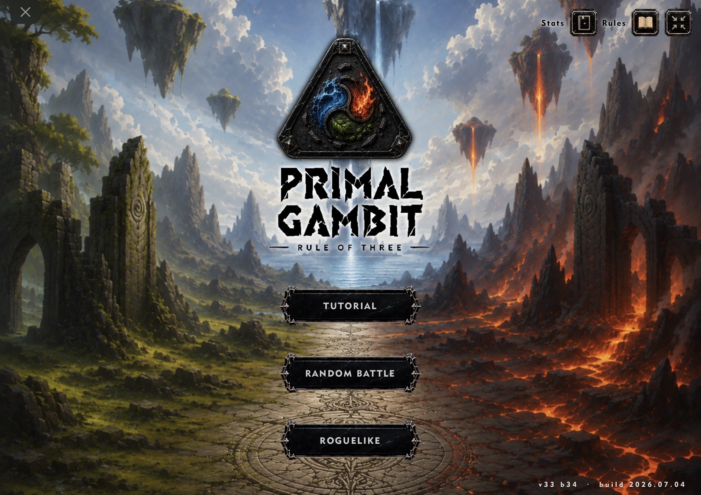
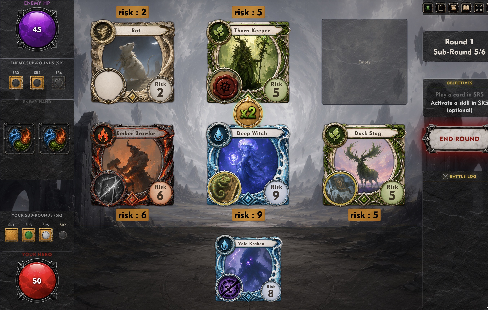
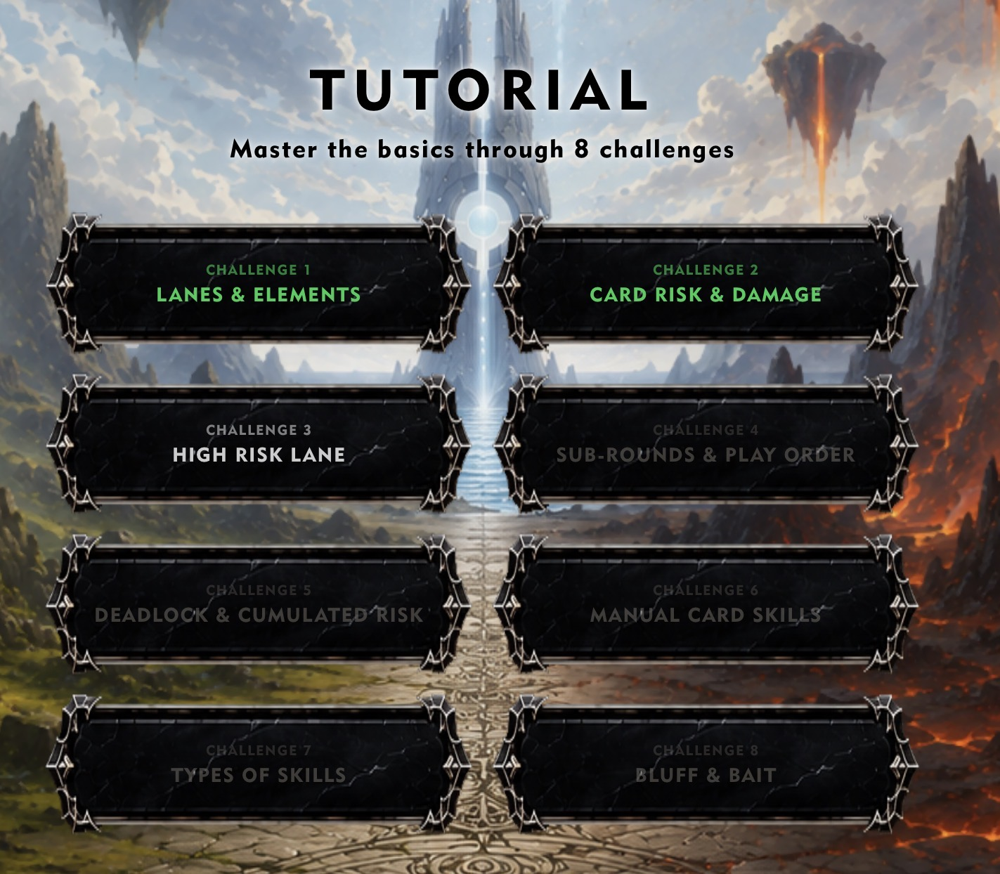
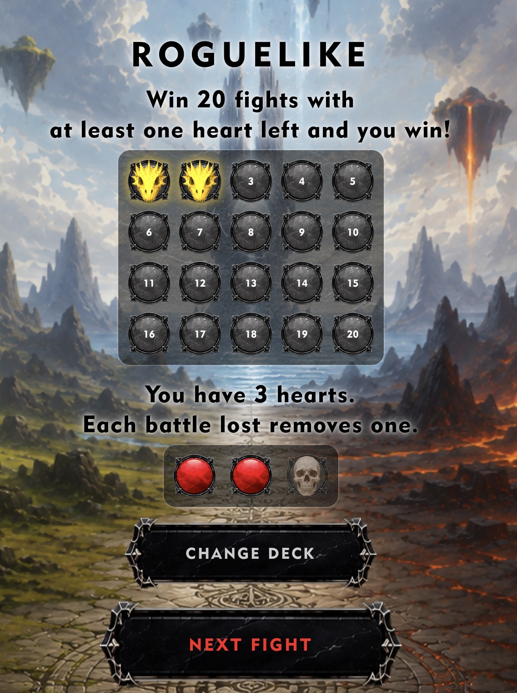
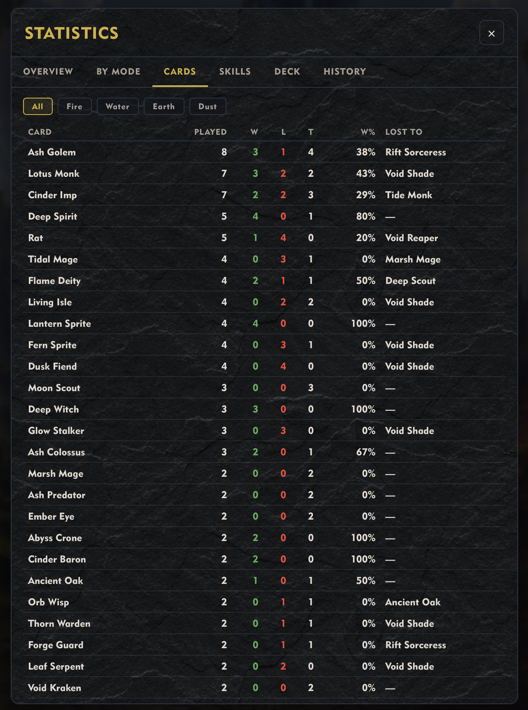
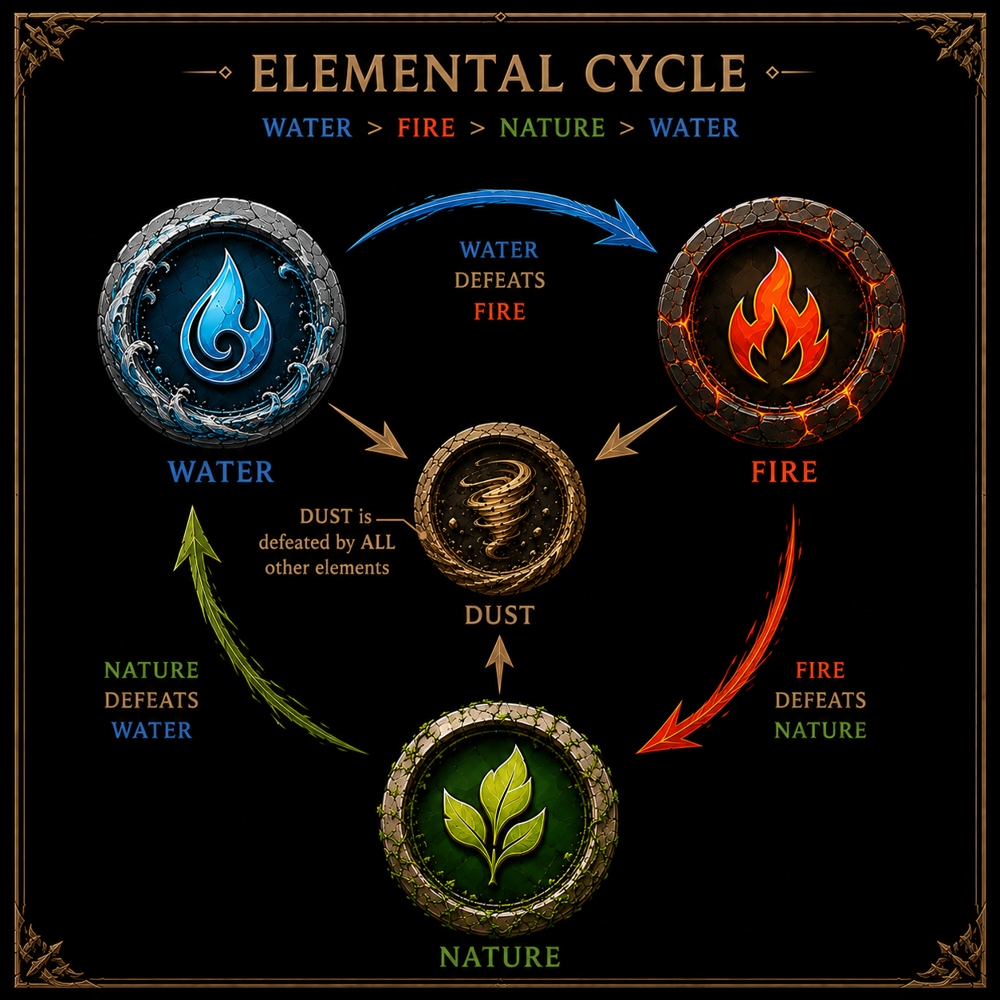
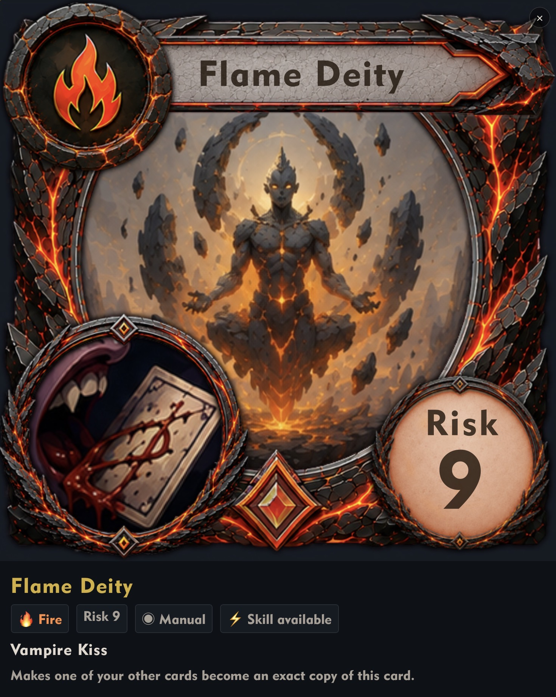

# Primal Gambit — Rule of Three

> *A fan-made revival of EarthCore, built with love, stubbornness, and a lot of AI assistance.*

---

## What is Primal Gambit?

If you ever played **EarthCore: Shattered Elements**, you know the feeling. A card game that was deep, elegant, and just different enough to get under your skin. Then one day it was gone — servers down, no warning, no farewell. Just gone.

I spent hundreds of hours on that game. And I missed it.

So I decided to rebuild it. Not as a professional developer — I'm not one. As someone who wanted to play it again, and figured maybe other people did too. Old fans who remember it, and younger players who never got the chance.

This is **Primal Gambit: Rule of Three**. It's not a perfect replica. It's a fan interpretation — same core rules, same three-lane structure, same elemental triangle (Fire beats Water, Water beats Earth, Earth beats Fire, Dust loses to everything but has the lowest Risk). But rebuilt from scratch in a single HTML file, with new art generated by AI, a tutorial, statistics, a roguelike mode, and enough content to be its own thing.

If you were an EarthCore player: hello, I hope this brings back some good memories.

---

## Features

### Game Modes
- **Random Battle** — quick single match against an AI opponent, with 5 difficulty levels (Very Easy → Very Hard)
- **Tutorial** — 8 guided puzzles that introduce the rules one mechanic at a time, with speech bubbles from the cards themselves
- **Roguelike** — a campaign of 20 consecutive fights. You start with a basic deck, earn 2 new cards after each win, and have 3 lives. Lose 3 fights and the run ends.

| | |
|---|---|
|  |  |
| *Combat at SR5 — End Round button active* | *Tutorial hub — challenges 1 & 2 cleared* |
|  |  |
| *Roguelike hub — 2 fights won, 1 life lost* | *Statistics panel — Cards tab* |

### Cards & Skills
- **49 unique cards** currently playable, across 4 elements: Fire 🔥, Water 💧, Earth 🌿, Dust ◈

*The core mechanic: Fire beats Water, Water beats Earth, Earth beats Fire. Dust loses to everything — but has the lowest Risk.*
- **30+ skills**, ranging from passive effects (Vendetta, Seal, Backstab) to manual abilities (Strike, Overgrowth, Vampire Kiss, Disguise Ally) to instants that trigger on placement
- Card compendium integrated in the Rules panel

*Each card has full art, its element, Risk value, and a unique power. Tap any card in the compendium to open this panel.*

### Statistics
- Persistent stats across all sessions (stored in browser localStorage)
- Tracks wins/losses/ties, damage dealt and received, skills used, card performance, deck composition, and records (max damage in a single lane or round, closest win, etc.)
- Per-mode breakdown (each difficulty level, roguelike runs, tutorial puzzles)
- Time tracking — combat time, deck builder time, hub time

### Other
- Portrait and landscape layout support
- Mulligan system before each fight
- Detailed rules panel with card compendium
- Debug tools for development

---

## How to play

### Online basic (recommended)

Just open the links below in your browser for the remote version. Keep it as as bookmark if you want. Done.

🔗 [Play online from github](https://pizzattack.github.io/Primal-Gambit/)

🔗 [Play online from stitch.io](https://pizzattack.itch.io/primal-gambit)

## Online as a Web App

Primal Gambit can be installed on your phone or tablet's home screen and runs like a native app — no app store required. Once installed, the game runs in its own window/icon, independent of your browser tabs, and works the same way as before — installation just adds a shortcut, no extra download.

**iOS (Safari)**
1. Open the game in **Safari** (installation only works from Safari, not Chrome or other browsers on iOS).
2. Tap the **Share** button (square with an arrow pointing up) in the toolbar.
3. Scroll down and tap **Add to Home Screen**.
4. Tap **Add** in the top-right corner.
5. Launch the game from the new icon on your home screen — it opens full-screen, without Safari's address bar.

**Android (Chrome)**
1. Open the game in **Chrome**.
2. Tap the **⋮** menu (top-right corner).
3. Tap **Install app** (or **Add to Home screen**, depending on your Chrome version).
4. Confirm by tapping **Install**.
5. Launch the game from the new icon in your app drawer or home screen.

**Desktop (Chrome / Edge)**
1. Open the game in Chrome or Edge.
2. Click the **install icon** (⊕ or a small monitor icon) in the address bar.
3. Click **Install**.

### Local installation

Download the ZIP from the github repository (green **Code** button → **Download ZIP**), unzip it, and open `index.html` with your browser

1. On desktop (Windows / Mac / Linux), open `index.html` directly in Chrome, Firefox, or Safari. No server needed.

2. On iOS, the built-in "Open in..." won't work because Apple blocks local HTML files in safari. Use a local HTML viewer such as ([HTML Viewer Q](https://apps.apple.com/app/html-viewer-q/id810042973) ) — a free app by Spica that lets you load and run local HTML files with full JavaScript support. Load `index.html` from the Files app after unzipping.

3. On Android, open the file directly in Chrome or use a local server app like **HTTP Server by pddl**. Chrome on Android handles local HTML files well.

---

## About EarthCore

EarthCore: Shattered Elements was a mobile card game developed by Tequila Games, released around 2014. It featured a unique three-lane battle system, elemental rock-paper-scissors mechanics, and a risk-accumulation system that rewarded patience and misdirection. It was shut down without notice.

This project is a fan work, not affiliated with or endorsed by Tabletime. No original assets are used. This is purely a labor of love and is non-commercial.

---

## How Primal Gambit was built (and Credits)

I'm a solo developer working on this in my spare time. I have no formal training in web development. The entire project was built through a conversation — literally. I described what I wanted, and **Claude Sonnet** (Anthropic's AI) wrote the code. Thousands of lines of JavaScript, CSS, and HTML, written iteratively over months of back-and-forth.

It's been humbling, sometimes frustrating, occasionally magical. Wrangling AI tools to build something this complex is its own kind of challenge — you learn to describe things precisely, to debug by description, to hold an entire system in your head while asking a model to change one small piece of it. It doesn't always work. But when it does, it's very satisfying.

Card art was generated with **ChatGPT / DALL-E**.

All sound FX are from the amazing resource site [FreeSound.org](https://freesound.org/). The full credits list is in the repository.

All musics are from [Pixabay.com](https://pixabay.com/). Credits go to [Desifreemusic](https://pixabay.com/users/desifreemusic-28163210/), [Akoliks_aj](https://pixabay.com/users/ikoliks_aj-48415707/) and [Nastelbom](https://pixabay.com/users/nastelbom-48128234/).

---

## Status

This is an active personal project. Cards are added progressively — there are currently ~30 more cards theorycrafted and balanced with an AI-driven game simulator. Skills range from straightforward to mechanically complex. I will implement & upload more cards based on your feedback.

Bugs exist. The AI doesn't always make the right call. Some features are rougher than others. But it's playable, it's fun, and it's getting better.

---

## Changelog 

**v0.40 (August 2026)**
- Added preloading of images for slow internet connections
- Added favicon and manifest for a sweeter installation as a Web App

**v0.39 (August 2026)**

- Added localization in French, German, Spanish, Italian, Chinese, Japanese (AI made, feedback is welcome)
- Added prologue (short animated comics)
- Added hint micro-button
- Reworked difficulty levels for random and roguelike modes
- Reworked tutorials for clarity

---

## Contributing

- **Motivation** : Drop me a message here or an email (contact link in the game). Tell me what you like or don't like. Tell me your story. Just knowing other folks may enjoy this personnal project would be quite nice.

- **Promotion** : This game is a tiny island lost in a massive ocean of professional and amateur games with advertisement budgets and/or excellent marketing folks. I don't do social networks, and I have zero interest in self-promotion. If you think this free game deserves some advertisement, this area is by far what would help me most : let your friends and gaming circle Primal Gambit exists, maybe share a screenshot and link. Whatever you think is good. As I said, I am not good at that.

- **Bugs & suggestions** : This is a small project so your feedback is most welcome (report bugs, suggest new cards and features). Open a github issue if needed.

- **May be a small tip ?** : This is a free game. You don't have to donate and I have not set up a donation link yet. That said, if you enjoyed it and if you think it is worth a small tip, let me know. Your donation would help recoup the (small) dev costs. More importantly, it would be an excellent incentive to keep developing new features and cards. 
